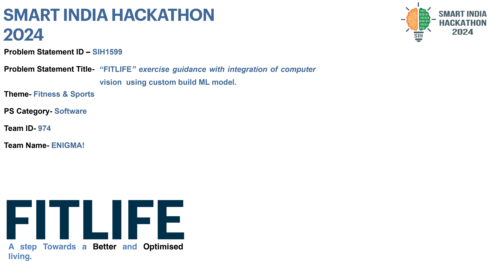
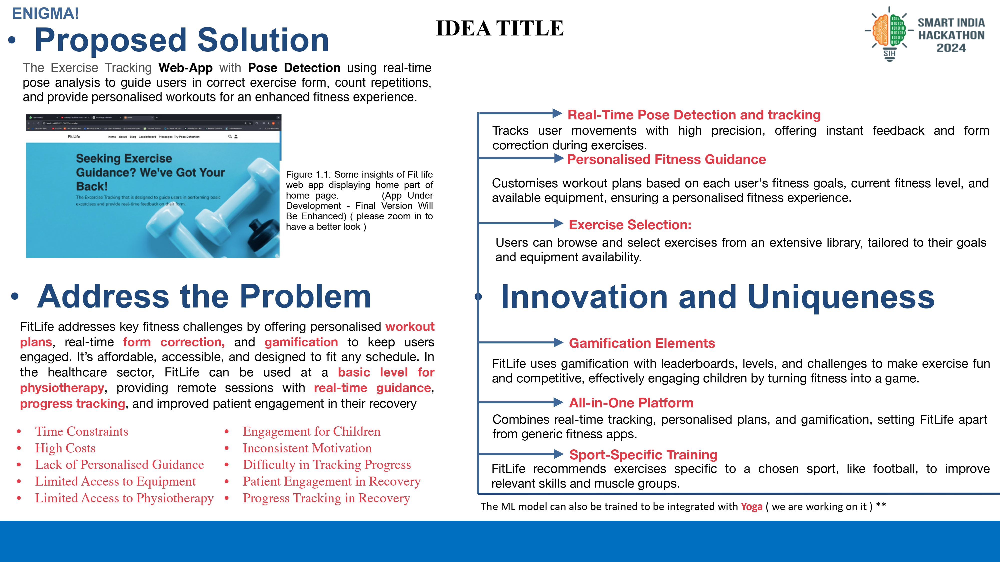
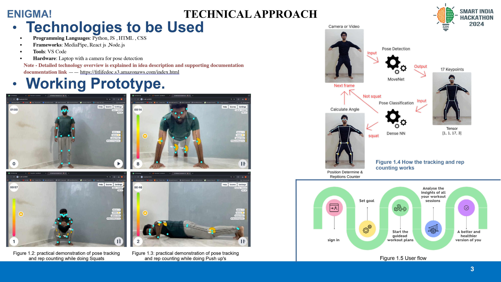
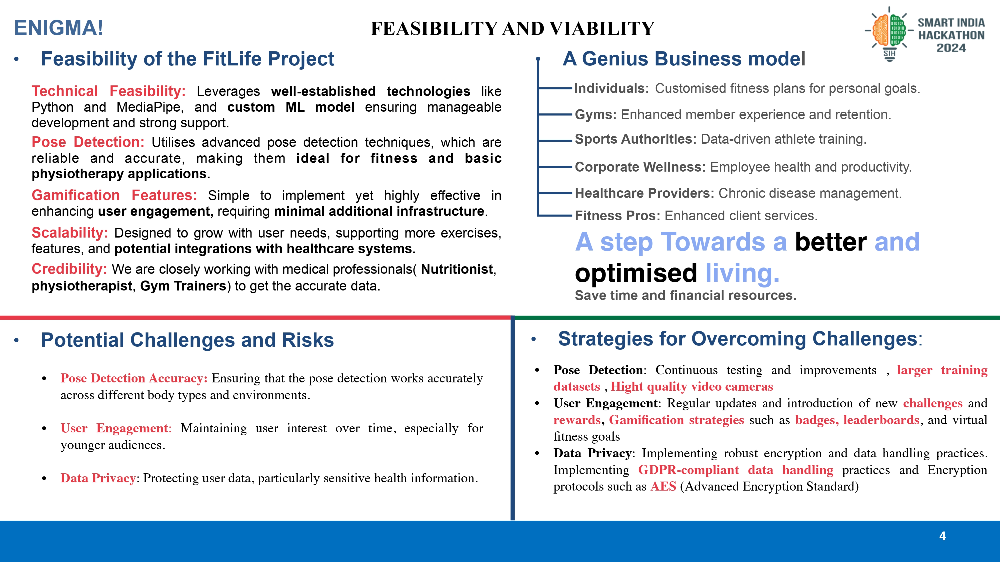
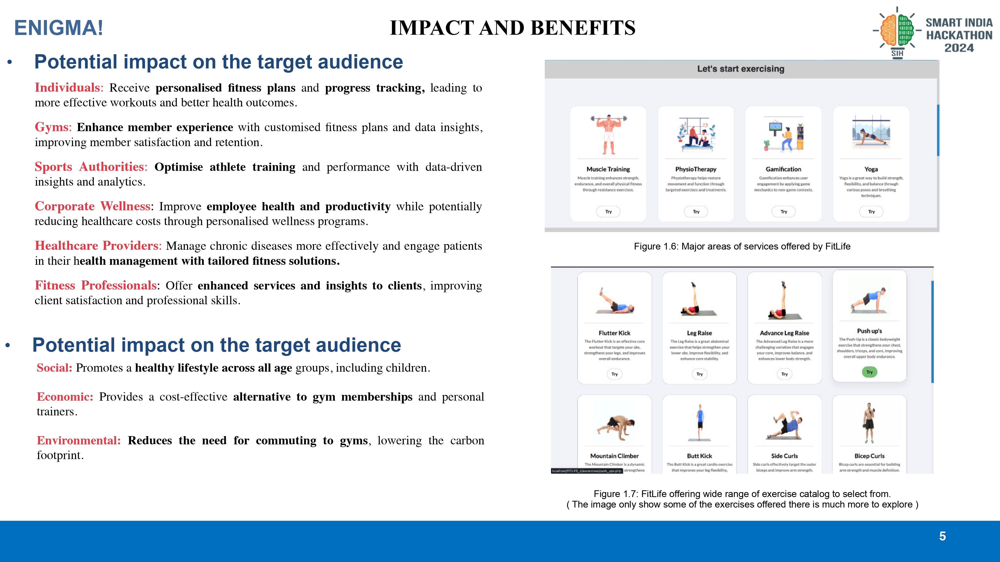
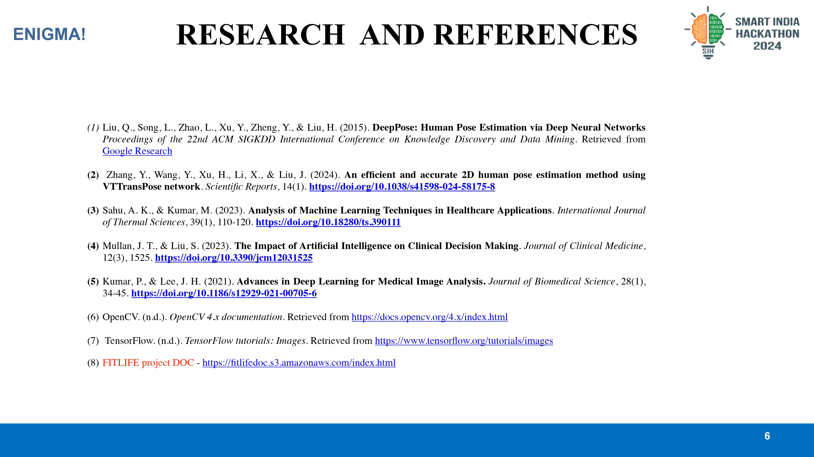

---

# FITLIFE

**FITLIFE** is a revolutionary fitness and wellness management system developed during the Smart India Hackathon (SIH) 2023. The platform is designed to assist users in tracking their fitness journey, setting personalized goals, and maintaining a healthy lifestyle through smart recommendations and advanced analytics. The project combines modern technologies like machine learning and IoT integration to provide users with a seamless fitness experience.

---
## project demo 
https://www.youtube.com/watch?v=M9ZTeqHJ7fY

## About the Code

Due to **SIH 2023 copyright policies**, the actual backend code files cannot be uploaded to this repository. However, this README provides a detailed explanation of how the project works and the technologies involved.

---

## FITLIFE Presentation

Here is a quick look at the slides showcasing the FITLIFE project:

### Slide 1

### Slide 2

### Slide 3

### Slide 4

### Slide 5

### Slide 6

## How FITLIFE Works

### 1. User Interaction
- Users interact with FITLIFE through a mobile or web-based application.
- The platform provides an intuitive user interface to input health-related data like weight, age, fitness goals, and daily activity logs.

### 2. Smart Recommendations
- FITLIFE uses advanced machine learning models to analyze user data and generate personalized fitness and diet recommendations.
- Recommendations are updated dynamically based on the user's progress and feedback.

### 3. Real-Time Monitoring
- IoT devices such as fitness bands or smartwatches can be integrated with the system to provide real-time tracking of metrics like heart rate, steps taken, and calories burned.
- The collected data is processed and visualized in easy-to-understand dashboards.

### 4. Goal Setting and Progress Tracking
- Users can set fitness goals, such as weight loss, muscle gain, or improved endurance.
- FITLIFE tracks progress against these goals and provides motivational insights to keep users engaged.

### 5. Community Engagement
- FITLIFE incorporates a social aspect, allowing users to join fitness challenges, share achievements, and connect with like-minded individuals.

### 6. Backend Processing
- The backend consists of:
  - **Data Storage**: A secure database to store user information and IoT device logs.
  - **Machine Learning Models**: Algorithms for personalized recommendations and anomaly detection.
  - **API Services**: RESTful APIs to facilitate seamless communication between the frontend and backend.

---

## Project Status

This repository contains an overview of the **FITLIFE** project. While the backend code is not available due to copyright restrictions, the documentation and workflows are provided to help understand the system's architecture and functionality.

---

## Future Enhancements

- Expand IoT integration for additional fitness devices.
- Introduce gamification features to improve user engagement.
- Implement advanced analytics for more precise fitness insights.

---

## License

This project is under **SIH 2023 Copyright Policies** and cannot be reproduced or distributed without explicit permission.

---

## Author

[**Kunal Chaugule**](https://medium.com/@kunalchaugule.2003)  
Junior Machine Learning Engineer | Computer Vision Enthusiast  

---

